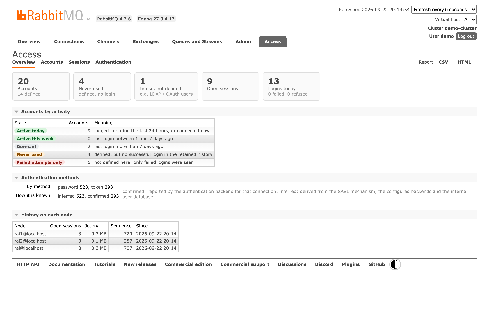

# rabbitmq_access_insight

**Access Insight for RabbitMQ** — who connects to your broker, from where,
and how they authenticate. A plugin that runs inside every node, keeps its
own history, and adds an **Access** tab to the management UI, an HTTP API and
Prometheus metrics.

<!-- screenshots are produced by test/ui/screenshots.mjs -->


- **Accounts** — every defined account against actual logins: first and last
  login, sessions, time online, sources, clients, virtual hosts and
  protocols. Which accounts are active, dormant or never used, and which log
  in without being defined here (LDAP, OAuth 2 …).
- **Authentication** — every login by result and stage: credentials refused,
  or accepted and then refused by authorization or virtual host access. The
  method of each session — password, token, certificate — marked as
  *confirmed* or *inferred*.
- **Sessions** — open and recently closed, from any node.
- **History that survives** — kept on each node's disk, restored after a
  restart, and account totals replicated to the other nodes, so a lost node
  or disk does not lose them. What could not be recorded is shown as a gap,
  never silently skipped.
- **Reports** — the account reconciliation report as CSV or HTML.

It only observes: it never takes part in allowing or refusing a connection,
and never stores passwords, tokens or message bodies. It works on unmodified
official RabbitMQ releases **3.12 to 4.3** (Erlang/OTP 25 to 28).

## Install

Download the `.ez` matching your broker's Erlang/OTP from the
[latest release](https://github.com/msgyard/rabbitmq-access-insight/releases/latest),
copy it into the plugins directory of **every** node and enable it:

```sh
rabbitmq-plugins enable rabbitmq_access_insight
```

| your broker's OTP | asset |
|---|---|
| 25 | `rabbitmq_access_insight-<vsn>-otp25.ez` |
| 26 | `rabbitmq_access_insight-<vsn>-otp26.ez` |
| 27, 28 or 29 | `rabbitmq_access_insight-<vsn>-otp27.ez` |

Enabling and disabling take effect at runtime; no restart is needed. When
enabled on a running node, connections already open are picked up.

## Where to look

| | needs | |
|---|---|---|
| **Access** tab in the management UI | `rabbitmq_management` | users with the `monitoring` or `administrator` tag |
| `/api/access/v1/…` on the management port | `rabbitmq_management` | same login as the management API |
| `rabbitmq_access_*` on `:15692/metrics` | `rabbitmq_prometheus` | added to RabbitMQ's own metrics |
| `http://127.0.0.1:15693/` | nothing | the plugin's own endpoint: status page, `/metrics`, `/api/access/v1/…` with basic auth |

None of the other plugins is required. When one is missing, the status page
and the Access tab say what is missing, what it affects and how to enable it.

## What the numbers mean

### A login, step by step

RabbitMQ checks a login in three steps: the credentials, then authorization,
then access to the virtual host. Only a connection that passed all three is a
session.

| outcome | recorded as |
|---|---|
| credentials refused | **failed**, stage *credentials*, with RabbitMQ's reason |
| credentials accepted, then refused (unknown user, no access to the virtual host) | **refused**, stage *access* |
| connection opened | **session** |

This holds for AMQP 0-9-1, MQTT and STOMP, for AMQP 1.0 on RabbitMQ 4.x, and
for direct connections inside the broker (shovels, federation). On RabbitMQ
3.x, AMQP 1.0 is served by the `rabbitmq_amqp1_0` plugin, which publishes no
login or connection events, so those logins cannot be recorded there.

### Authentication method: confirmed or inferred

RabbitMQ does not record which backend accepted a credential — a password and
a token both arrive as `PLAIN`. The method of each session is therefore:

1. **confirmed** when the authentication backend published an
   `access_auth_verified` event for the connection (see
   [the access event convention](#access-event-convention));
2. **certificate**, inferred, when the SASL mechanism is `EXTERNAL`;
3. **password**, inferred, when the internal backend is the only one configured;
4. **other**, inferred, when the account has no password in the internal
   database or is not in it;
5. otherwise **unknown**.

### Account states

| state | meaning |
|---|---|
| active today | logged in during the last 24 hours, or connected now |
| active this week | last login 1 to 7 days ago |
| dormant | last login more than 7 days ago |
| never used | defined, but no successful login in the retained history |
| failed attempts only | not defined here; only failed logins were seen |

## History, replication and gaps

Each node writes what happens on it to a journal under
`<data dir>/access_insight` (it moves with the data directory), and keeps
per-account totals derived from it. A snapshot is written every five minutes
and on shutdown; after a restart the snapshot is restored and the journal
after it replayed. A hard crash loses at most one second
(`history.sync_interval`).

Account totals — profiles and daily figures, a few megabytes for thousands of
accounts — are copied to every other node. Each node writes only its own
contribution, so copies never conflict and are counted once when merged. If
a node loses its disk or leaves the cluster, its accounts' history remains on
the others; a node that left can be forgotten on purpose (below). Session
detail stays on the node that recorded it.

Anything that could not be recorded is marked with its time range and reason:
an unclean stop, a disk alarm (the journal pauses), or events dropped because
the plugin fell behind — it drops rather than slow the broker down.

## Configuration

All settings are optional (`rabbitmq.conf`). On RabbitMQ 3.x, as for any
plugin, a node refuses to boot with `access_insight.*` settings while the
plugin is not enabled on it: enable the plugin first.

| setting | default | |
|---|---|---|
| `access_insight.history.dir` | `<data dir>/access_insight` | journal and snapshots |
| `access_insight.history.max_disk` | `512MB` | journal disk budget; oldest detail is removed beyond it |
| `access_insight.history.log_days` | `30` | days of session and login detail |
| `access_insight.history.rollup_days` | `400` | days of per-account daily totals |
| `access_insight.history.sync_interval` | `1000` | ms between journal fsyncs |
| `access_insight.history.snapshot_interval` | `300000` | ms between snapshots |
| `access_insight.replication.enabled` | `true` | copy account totals to the other nodes |
| `access_insight.replication.interval` | `60000` | ms between replication rounds |
| `access_insight.metrics.export` | `auto` | `auto`, `prometheus`, `standalone`, `both`, `off` |
| `access_insight.metrics.per_user` | `true` | label metrics by user; turn off for very many accounts |
| `access_insight.http.enabled` | `true` | the plugin's own endpoint |
| `access_insight.http.listener.ip` | `127.0.0.1` | |
| `access_insight.http.listener.port` | `15693` | |
| `access_insight.limits.max_users` | `100000` | accounts tracked per node; further names are counted as `(other)` |
| `access_insight.limits.max_set` | `64` | sources, clients … kept per account and node |

## HTTP API

Under `/api/access/v1/` on the management port or the plugin's endpoint. A
`monitoring` or `administrator` tag is required; `DELETE` requires
`administrator`.

| | |
|---|---|
| `GET status` | plugin, capabilities and history of every node |
| `GET overview` | cluster totals |
| `GET users?state=&search=&sort=&order=&page=&page_size=` | accounts |
| `GET users/{name}` | one account: profile, daily figures, failures, sessions |
| `GET sessions?user=&limit=` | open and recently closed sessions |
| `GET auth?days=` | logins per day, methods, failures by source and reason |
| `GET nodes` | history epochs of every node and replication state |
| `DELETE nodes/{node}` | forget a node that has left the cluster |
| `GET records?node=&since=&limit=` | raw journal records of a node, for export |
| `GET report`, `report.csv`, `report.html` | account reconciliation report |

## Metrics

| metric | type | labels |
|---|---|---|
| `rabbitmq_access_sessions_active` | gauge | vhost, user, auth_method |
| `rabbitmq_access_sessions_opened_total` | counter | vhost, user, auth_method, protocol |
| `rabbitmq_access_auth_attempts_total` | counter | user, auth_method, result, stage |
| `rabbitmq_access_session_duration_seconds` | histogram | vhost, user |
| `rabbitmq_access_token_expiry_seconds` | gauge | user (when the backend reports `exp`) |
| `rabbitmq_access_users` | gauge | state — cluster-wide, the same on every node |
| `rabbitmq_access_events_dropped_total` | counter | |
| `rabbitmq_access_journal_bytes` | gauge | |

Like RabbitMQ's own metrics, each node reports what happened on it: sum across
nodes. Connection names, peer addresses and client names are never labels.

## Operations

- **Disk**: at most `history.max_disk` for the journal, plus snapshots of the
  totals.
- **A node left the cluster**: its accounts' history is kept and shown as
  *left cluster*. To remove it everywhere:
  `curl -u admin -X DELETE http://<node>:15672/api/access/v1/nodes/rabbit@old-host`
- **Start over on one node**: disable the plugin, delete its history directory,
  enable it. The node starts a new history; its earlier totals remain in the
  other nodes' copies until forgotten.
- **Performance**: the plugin does its work in its own processes and never
  blocks connection setup. See [performance](#performance).

## Access event convention

Authentication backends can tell which credential they verified by publishing
this event from the connection process, after verifying it:

```erlang
rabbit_event:notify(access_auth_verified,
    [{schema_version, 1}, {stage, verified}, {user, Subject}, {backend, ?MODULE},
     {method, token},                      % password | token | certificate | other
     {pid, self()}, {node, node()}
     %% optional: {login, _}, {credential, _}, {alg, _}, {connection_name, _},
     %%           {exp, _}, {iat, _}, {nbf, _}, {iss, _}, {kid, _}
    ]).
```

Never include the credential itself. The event means the credential was
verified, not that the login succeeded; the plugin joins it to the
connection by `pid`. With it, the method of those sessions is shown as
confirmed.

## Performance

The plugin works when connections open and close, in its own processes, and
never blocks connection setup or messages. Measured with `test/perf/bench.py`
on a laptop (Apple M3), the plugin disabled and enabled in turn on the same
node, 3 rounds of 6,000 connections each (open, channel, close) from six
clients, CPU time of the broker process minus its idle rate:

| | RabbitMQ 3.12.14 / OTP 26 | RabbitMQ 4.3.6 / OTP 27 |
|---|---|---|
| broker CPU per connection, plugin off | 0.980 ms | 0.980 ms |
| broker CPU per connection, plugin on | 1.047 ms | 1.036 ms |
| **overhead under a constant connection storm** | **+6.8%** | **+5.8%** |
| publish throughput, off / on (msg/s) | 50,816 / 50,597 | 56,367 / 56,517 |
| records written while publishing 50,000 messages | 0 | 0 |

Workloads with long-lived connections see a small fraction of this. Memory
is bounded: after 100,000 sessions and 20,000 distinct failing user names the
plugin's tables held 19–25 MB, the recent-activity buffer 5,000 entries, and
the user rows were capped at `limits.max_users`.

## Build and test

```sh
./run-tests.sh --rmq-release 4.3.6     # unit tests against a RabbitMQ release
./build-ez.sh  --rmq-release 4.3.6     # the .ez for the Erlang/OTP you run
test/e2e/cluster_e2e.sh …              # three-node cluster test (see the file)
```

See [CONTRIBUTING.md](CONTRIBUTING.md).

## License

[Mozilla Public License 2.0](LICENSE), the same license as RabbitMQ.

This is an independent community project, part of
[msgyard](https://msgyard.bitey.ai). It is not affiliated with, endorsed or
sponsored by Broadcom or the RabbitMQ team. RabbitMQ is a trademark of
Broadcom Inc. and its subsidiaries.
